# Developing Your First R Package

## Overview

An R package is a nice tidy way to reuse and share functions you have created. Most packages fall into one of three different categories:

* **Packages that have some specific topical function**: This would include packages like readXL or scrapeR that are designed with a number of functions to do one sort of thing (read in files and scrape files off the web respectively). These kinds of packages also often accompany publications about new statistical techniquesand provide a way for other people to use the method. Almost always available on CRAN.
* **Utility Packages**: These packages might do lots of general stuff like igraph or MCMCpack which provide lots of utility functions for dealing with networks and MCMC inference respectively. Almost always available on CRAN.
* **Personal Packages**: There are some packages that just have a bunch of random functions somebody wrote that they find useful. These are mostly restricted to Github in terms of distribution. 

Developing a [personal package](http://hilaryparker.com/2013/04/03/personal-r-packages/) is a really good place to start, so that is what we will focus on in this tutorial. We will work to put a simple personal package up on Github and make it so you can download it on another computer and have it work. There are a ton of tutorials out there so I will focus on the things I had to figure out for myself, including how to incorporate C++ and python code into a package. 

### The Tutorials I Used 

As I mentioned above, there are a ton of good tutorials out there for developing your own R package. Here are just a few you should check out. 

* I started with this [great blog post by Hillary Parker](http://hilaryparker.com/2014/04/29/writing-an-r-package-from-scratch/) that goes over the minimal number of steps necessary to create a very simple R package and post it to Github 
* Hadley Wickham also wrote a book on R packages, aptly named **R Packages** -- which is also availabe online for free here -- <http://r-pkgs.had.co.nz/>. This was the source I probably used most heavily.
* A nice little blog post on [including Python code in an R package ](http://blog.quantitations.com/tutorial/2012/11/17/including-python-code-in-an-r-package/).
* A little tutorial on [putting your R package on Github](http://kbroman.org/pkg_primer/pages/github.html).
* A must-read short tutorial on [using RStudio for R package development](https://support.rstudio.com/hc/en-us/articles/200486488-Developing-Packages-with-RStudio).
* The Bible -- [Writing R Extensions](http://cran.r-project.org/doc/manuals/r-release/R-exts.html) is the most comprehensive reference for R package development. However it is really too detailed for most of what we want to do at this point.

## Getting Started with Dropbox, Github, and RStudio

### How To Structure Your Directory

I have found that the best structure for package development is to put the package directory inside of a `Package_Development` folder which I store on Dropbox. This way I can keep scratch files associated with package development in one place. I also suggest creating a repo for your package and uploading it to Github so you can download it. However, to make it easy for you and others to download your package from Github, you will only want to include the package directory itself in your repo, and not the `Package_Development` folder. To make sure that you do not lose any of your associated files in this folder, I suggest you keep it in your Dropbox. Here is a screenshot for the file structure of an example package I am developing:  
  
  

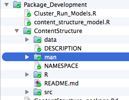  
  
  
Alternatively, you can just have the package as a stand alone directory as in the following example if you do not anticipate needing lots of scratch files or have some other place to put them, as in the following example:  
  
  
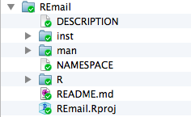

### Creating A Package In RStudio

To create a package in RStudio, you will want to check out [this tutorial](https://support.rstudio.com/hc/en-us/articles/200486488-Developing-Packages-with-RStudio) and then follow the steps outlined below. First you will want to install the `devtools` library as it will make you life way easier!

	install.packages("devtools")

Next, you will want to click on the projects tab and select **New Project**: 
  
  
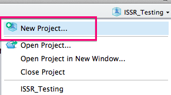  
  
  
You will then want to select **New Directory**:   

  
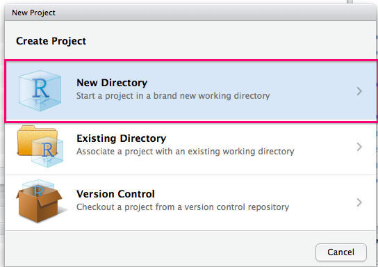   
 
       
You should then selecte **R Package**:  
  
    
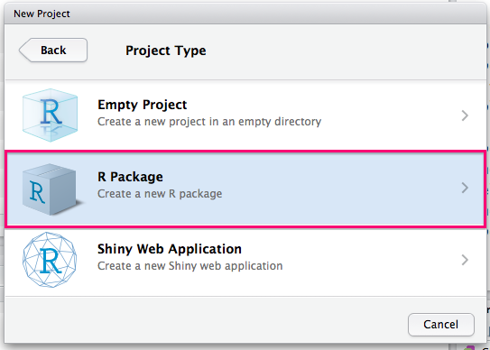  
  
    
You will then need to choose a name for your package and select a directory to create it as a subdirectory of. You should also check the box to create a Git repo.    

  
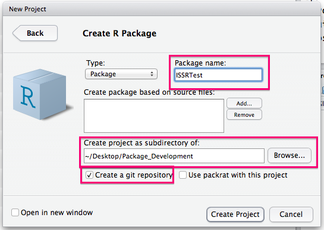  
  
  
You can now remove the example function (just delete the R file) and start to add functions to the R subdirectory. I am adding a `Clean_String.R` function (detailed in the next subsection) in this example: 
  

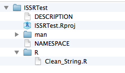  
  
  
Now you can go and select **Add** in your Github client and then navigate to the package directory, make your initial commit and publish your R package skeleton!  
  
 
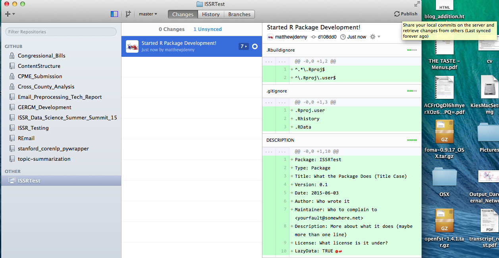   
  
  
Now it is time to edit the `DESCRIPTION` file and fill it in with some more informative text as in the following example:  
  
  
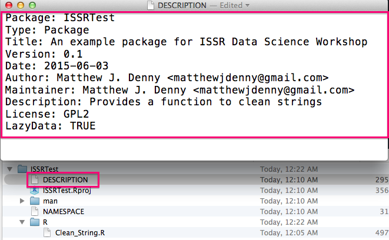  
  
  
You will then want to make sure you properly document all functions you want to make visible to package users (described in detail below in the **Documenting** subsection). You will then be able to use the `devtools::document()`  function to automatically generate help files for each of these functions and the `devtools::use_package()` function to make any packages your functions relies on dependencies of your package.  
  
  
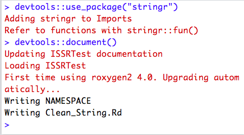  
  
  
You can now go Ahead and click on  the **Build** tab in RStudio and then on the **Build and Reload** button in this tab and R will build your package!
  
    
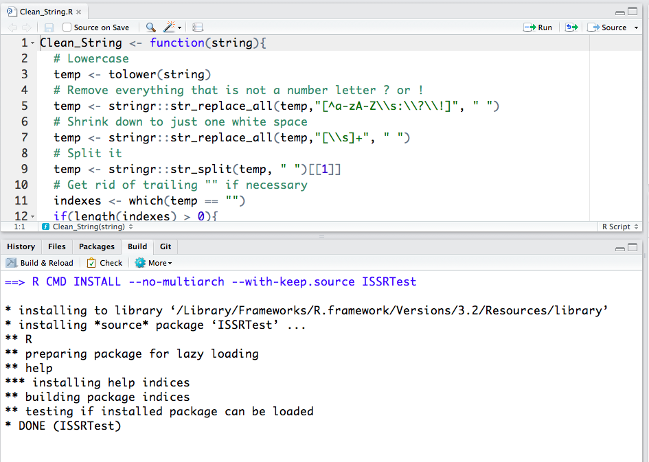  

  
You will now notice that more files have been added to the package directory (The help files for your functions).  
  
  
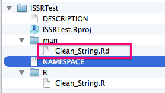    
	  
	   
You should now be able to access your package on your local machine by using the standard  `library(mypackage)`  command. You are cooking with gas! The next step is to upload your updated package to Github. If all went well, other people will be able to download and install your package by first installing `devtools` and then running the following command:

	devtools::install_github("yourGithubUsername/yourPackageName")
	
Its that simple. Give it a try, then start iterating. The sky is literally the limit. 
## Your First Function
For our first function, we will just define a simple string cleaning function that takes a messy string and removes all characters that are not letters and then tokenizes the resulting string. I have found this to be useful for a wide range of text processing tasks. We will want to save this function in the `./R` subdirectory of our package and call the file by the same name as the function, so we would call this `Clean_String.R`

	Clean_String <- function(str){
	  # Lowercase
	  temp <- tolower(str)
	  # Remove everything that is not a letter
	  temp <- stringr::str_replace_all(temp,"[^a-zA-Z\\s]", " ")
	  # Shrink down to just one white space
	  temp <- stringr::str_replace_all(temp,"[\\s]+", " ")
	  # Split it
	  temp <- stringr::str_split(temp, " ")[[1]]
	  # Get rid of trailing "" if necessary
	  indexes <- which(temp == "")
	  if(length(indexes) > 0){
	    temp <- temp[-indexes]
	  }
	  return(temp)
	}

Once we have saved the file, the package directory should look something like this:

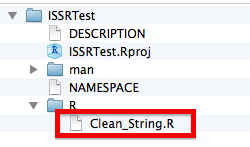  
## Dependencies
If the functions we want to use require access to any other packages, we can make sure that they are added as dependencies (which will be automatically downloaded with the package) by running the following line of code for each package we want to require (with the appropriate package name inserted):

	devtools::use_package("stringr")

Note that the best way to access the functionality these packages provide is to explicitly reference their sub-functions when we need them instead of loading the whole pakage as in the following example:

	stringr::str_replace_all(temp,"[^a-zA-Z\\s]", " ")

This can seem tedious at first, but will end up reducing conflicts and making your life easier in the long run. You may also want to ensure that your users have a newer version of R installed. You can do this by adding the following line to your `DESCRIPTION` file

	Depends: R (>= 3.0.1)
	
Here is an example of the imports and depends in the `DESCRIPTION` file for one of the packages I am currently working on:

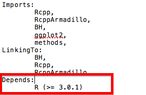

## Documenting

We can make use of the totally awesome `roxygen2` package to do all of the function documenting for us if we stick to the following commenting format for function definitions in our R source files:

	#' A Function to clean a single input string by removing punctuation and numbers and tokenizing it.
	#' 
	#' @param str A single input string such as "This is a cool function!" 
	#' @return A vector contain all valid tokens in the original input string
	#' @export
	Clean_String <- function(str){
		...

The first line should include a short general description of what the function does. Then for each parameter we can pass in to the function we will want to include an `@param` statment, followed by a space, followed by the parameter name exactly as it appears in our function, followed by a space, followed by a description of what that parameter can be. We may also want to include a `@return` statement telling the user what the function returns. Critically, if we want the user to be able to access the function in R, we will want to inlcude a `@export` on the line directly before the function definition begins. Once we have documented each function we wish the user to have access to in this way (internal functions do not need to be documented), we can then run the following command to generate help files for our functions automatically:

	devtools::document()
	
Following the suggestion in Hadley Wickham's R Packages book, you will also want to include an R file (possibly with the same name as your package -- I prefer to call mine `Package_Documentation.R` -- It does not really matter what you call it) in the `R` folder in your package directory. In this file you can document the whole package itself and not just the individual functions. You can also include other useful statments that will automatically take care of some of the setup for using C++ code (for example) which means you do not have to remeber to do these things by hand. Here is a very basic example of how this could look:

	#' MyPackage: A package for estimating some cool stuff!
	#'
	#' @section MyPackage functions:
	#' Give an overview of your functions here
	#'
	#' @docType package
	#' @name MyPackage
	NULL
	#> NULL

	#' @import methods
	NULL

	#' @useDynLib GERGM
	#' @importFrom Rcpp sourceCpp
	NULL

REally, you should just be checking out hte chapter in [**Hadley Wickham's book**](http://r-pkgs.had.co.nz/man.html) to figure out how to do this, as it is much more thorough, but this code can atleast get you started. Note that they last three lines are necessary if you want to include C++ code in your package, and the `@import methods` statement is necessary if you want to create your own object class for your package. 

## Adding In C++ Code

Before going any further, I suggest you check out my tutorial [Using C++ and R code Together with Rcpp](http://www.mjdenny.com/Rcpp_Intro.html) to get the basics of C++ programming under your belt. You may also need to follow some of the steps at the beginning of this tutorial before you will even be able to install the Rcpp package and get it working, especially if you are using Windows or a certain versions of Mac OS X. If you are going to use C++ code in your R package, the first thing you will need to do is make sure your `DESCRIPTION` and `NAMESPACE` files are set up correctly. For the `NAMESPACE` file, you will want to make sure you add the following lines at the end of your file where `YourPackageName` is the exact (case sensitive) name of your package. 

	importFrom(Rcpp,evalCpp)
	useDynLib(YourPackageName)
	
You will want to do this ideally after you have documented your package so it will come after the export statements for any functions you wish to make available to users. I usually do this last before I try testing the package. You will also want to make sure you are requiring all of the necessary C++ packages for your particular project. The three main packages I use are `Rcpp`, `RcppArmadillo` and `BH`, so I would run the following lines of code which will update my `DESCRIPTION` file:

	devtools::use_package("Rcpp")
	devtools::use_package("RcppArmadillo")
	devtools::use_package("BH")

You will also want to make sure that any of these that you are using are also linked to, by filling out the `LinkingTo:` field in your `DESCRIPTION` files as follows:

	LinkingTo: 
	  Rcpp, 
	  RcppArmadillo,
	  BH

Thus, for me, the last lines of my `DESCRIPTION` file now look like this:

	Imports: 
	  Rcpp,
	  RcppArmadillo,
	  BH
	LinkingTo: 
	  Rcpp, 
	  RcppArmadillo,
	  BH
	  
To actually include C++ code in your package, you will want to create a `./src` subdirectory of your package, and then place your C++ files (following the Rcpp formatting guidelines) in that folder. When you actually build your package, it will automatically generate an additional file, `RcppExports.cpp`, which you should not mess with, but will be necessary to distribute your package.  

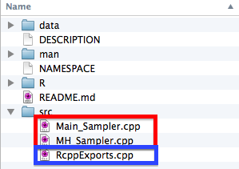

Furthermore, when you compile your package to try and use it on your computer. You will see a bunch of `.o` and `.so` files appear in your `./src` directory. 

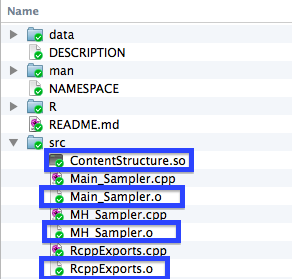

When you are syncing your package up to Gtihub, you will want to make sure that you "ignore" these files when syncing up to Github so that they do not get synced up to your repo. If they do get synced up, they can prevent other users from being able to install your package. To do so, we right click on the file when it shows up in the changes section of our Github desktop client, and then select ignore (or ignore all .x files) . In the example below I am illustrating this with .png files in this tutorial. 

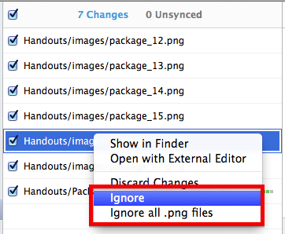

If everything went well, your Git Repo will now look something like this:

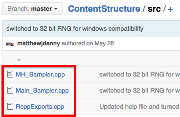

Now what you need to do is test, test, test! Moreso than with R code, you will need to make sure that your package works on many different operating systems and computers, and make sure you explain to you users how to make it work as C++ code is not universally supported out of the box on all OS's.

## Adding Python Code To A Package

Adding Python code to an R package does not require any modifications be made to the Python scripts, but does require some gymnastics with our R programming. It is also important to note that the user will need to have an appropriate version of Python installed on their computer. This is actually a pretty big deal and in general I suggest you write a robust tutorial for doing this for whichever operating systems you expect people to be using your package from. In particular, Windows can be quite tricky. However, if you are using a Linux or Mac OS, Python should be installed by default and most of what I describe below should just work. To include a Python file with your package, you will simply want to create a `.inst/` sub directory of your package, and save your file there, as in the following example:  
  
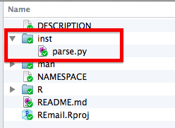 

If you want to call lines of Python code interactively directly from R, you will also need to install the [**rPython**](https://cran.r-project.org/web/packages/rPython/index.html) R package, which provides wrapper functions that can be used to make python commands. While this approach may be useful for some applications, especially where Python is only relied upon for a few simple tasks, a more robust and potentially easier to implement approach is to call Python script files using the command line directly. To do so, we will first need to determine the location of our python script. This can be done with the following line of code:   

	path <- paste(system.file(package="My_Package"), "parse.py", sep="/")
	
The `system.file()` call will find the path to where your package is installed, and the second argument should be the name of the actual python script. Now we will want to Generate the actual command we submit to our Python script. Teaching python is not the point of this tutorial, so the way you structure you commands is mostly up to you. In the example below, I am passing two commands to a Python script called `parse.py`: a filename for the document I want to parse (in this case an email), and the field I want to extract (in this case "to").

    command <- paste("python", path, filename, "to", sep = " ")
	
Now, in order to avoid execution stopping my whole function, and to avoid printing a whole bunch out output to the R console every time I run this command, I will actually execute the python command inside both a `try(...,silent = TRUE)` statement and a `suppressWarnings()` statement. In general, this is a bad idea as we are hiding the possibility of any errors from the user, but it can make sense if we are going to handle any and all potential errors ourselves (which is what I tend to do). 
	
	try(suppressWarnings(response <- system(command, intern=T)), silent = T

The `response <- system(command, intern=T)` line of code actually executes the python command, so if you do not want to do any error handling, you can just use this line of code by itself. However, if anything goes even slightly wrong, the execution of any R function that calls this code will also be halted. In my case, I just need to make sure that my code returned the "to" field of the email, if it did not, I will just want to let the user know that this was the case:  
	
	if(!is.null(attr(response,"status"))){
	    if(attr(response,"status") == 1){
	        response <- ""
	        cat("To Field Empty \n")
	    }
	}  
    
This is basically all you will need to actually call some Python code in your package. For reference, here is the chunk of Python code this function was calling:

	import email.parser
	import email.utils
	import sys
	def parseElement(filename,element):
		parser = email.parser.Parser()
		email_val = parser.parse(open(filename,"r"))
		element_val=None
		if element.lower()=="message":
			while True:
				try:
					email_val = email_val.get_payload(0)
				except:
					break
			element_val = email_val.get_payload()
		else:
			element_val=email_val.get_all(element)[0]
		if element_val!=None:
			print element_val
		else:
			print ""
	parseElement(sys.argv[1],sys.argv[2])

You can check out the `REmail` package that myself and my lab will be developing over the next few months (still in very rough shape) by [**clicking this link**](https://github.com/matthewjdenny/REmail). This may help you see how everything fits together. 

## Writing Robust Code

One thing you will definitely want to keep in mind when you are releasing a package into the wild is that your users will (unintentionally) be hell-bent on trying to use your code in ways you did not intend. This will most likely lead to very visible runtime catastrophes where a function breaks or R crashes. These are no fun, but atleast everyone knows that somethign went wrong. The more insidious problem is when the user gives your functions something they do not expect and they quitely go on to produce the wrong output, but in a way that it is hard to tell that somethign went wrong. This can lead people to draw the wrong inferences (very, very bad) or just throw up their hands in frustration if things just do not seem quite right and stop using your package. Fortunately there are several time consuming and slightly tedious things you can do to help your users not screw up, and to help them figure out what went wrong when they do.

### Document Your Code Very Well

While I already mentioned this above, good documentation is your first line of defence against code not working the way it should. Here are a few things I have found to work pretty well:

* **Be verbose** -- write more than you think you need to about each argument to any functions you make availabe to the user and try to really explain things using simpler words and concepts that people who do not have a huge amount of programming experience can understand. I have found this to be a real frustration when learning other languages and people on StackOverflow have answered my question but in words I do not understand. 
* **Give very simple working examples** -- you should seek to give toy examples using your code that cover all relevant use cases, yet are simple enough that it is apparent what is happening. Comment this code as well!
* **Give very clear names to varaibles** -- this will help your users keep track of what data is supposed to go where. 

### Warnings and Output

Another important way you can help your users out is to provide a lot of warning messages and output that tells them how things are going as your functions run. You may want to include some conditional statements that print a warning if something does not look right. For example if we are multiplying numbers in our package and expecting a non-negative result, we may want to check that this is the case before going any further.

	 if(result < 0){
	 		warning("The result was less than zero, you should get that checked out...")
	 }

We can also take a stronger approach and actually halt execution of hte function if some condition is met. This is sometimes the best way to deal with errors that mean that data or commands were not passed to the function in the correct form. We can accomplish this using the `stop()` function, as follows:

    if(class(data) != "matrix"){
    		stop("You did not supply the data as a matrix. Please supply your data as a matrix.")
    }

Implementing this kind of check for all of your functions will often avoid major problems that can lead to unintended consequences.

## Example Data

It will often be useful to add example data to your package as this will allow the users to make sure they understand the format your functions want and what their output should look like. Fortunately, this is pretty easy, as the `devtools` package provides a function for adding data to your package and ensuring it is in the right format. The first thing you will want to do is load all of the data objects you want to include with the package in to your R session. Each object should have the name you want it to have when your user sees it, and each object will be stored as a .rda file with the same name in the `./data` directory. You can then add the data by using the following command:

	devtools::use_data(my_data_1,my_data_2, my_data_3)

You can include as many objects as you want, but it is probably a good idea not to include huge datasets as this will make installing your package really slow. Once you have run the lines of code above, you can go to the directory and double check that everything is in the right place. Here is an example from a package I am currently working on:

## Distributing Your New Package
