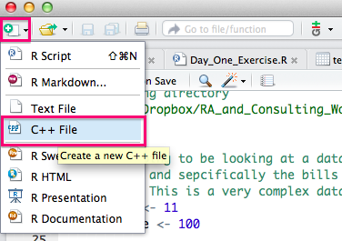
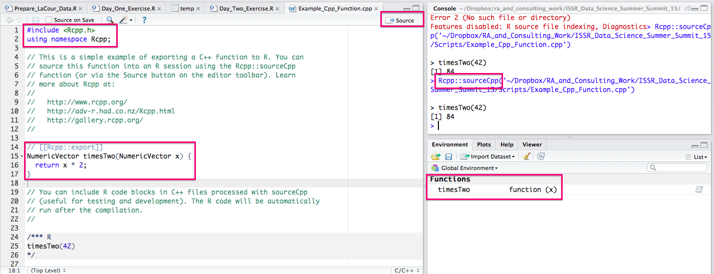
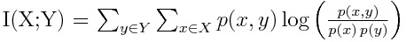

# Using C++ code in R

## Overview

As we have noted, R can be perfectly fast for some things but sometimes too slow for other things. In general, R is not the fastest or most memory efficient language out there -- but it is very easy to use, to share, and makes very pretty output. C++ is very fast, but not so easy to use, and was not designed with making pretty output in mind. However, when we put the two together in a smart way, we can both go fast and write code that is relatively easy to use. 

## Requirements for using C++ code with R

If you are using a Mac, you will need to start by making sure you have Xcode + developer tools installed or you will not be able to compile the C++ code that is used in the samplers for this package. You will need to go here: <https://developer.apple.com/xcode/downloads/> and then select the link to the additional downloads page which will prompt you to enter you apple ID. This will let you download the developer tools. This requirement is not unique to this package, but is necessary for all packages that use Rcpp.  
  
If you are using a Windows machine, you will need to make sure you have the latest release of R (3.2.0+) and will also need to install the `Rtools` library before you can use any packages with C++ code in them. It is also highly advised that you use [RStudio](http://www.rstudio.com/) to download and install the package as it seems to play nicer with Rcpp under Windows. You may also want to visit [this blog post](https://cdrv.wordpress.com/2013/01/12/getting-compilers-to-work-with-rcpp-rcpparmadillo/) which has more information on making C++ work with R under Windows. 
  
If you are using a Linux distro, make sure you have a C++ complier installed, but in general, you should not run into as many issues

## Rcpp, RcppArmadillo and RStudio

This is where `Rcpp` comes in. It is an R package that makes incorporating C++ code with R code pretty straightforward. The good folks over at RStudio have also baked in a lot of support for Rcpp right into RStudio, and have included a pretty useful debugger to boot. `RcppArmadillo` is an addon package that gives you access to tons of useful linear algebra functionality in C++. In particular it makes passing in and working with arrays, matricies and vectors pretty easy. Here are some resources to get you started:

* The official website for Rcpp is -- <http://www.rcpp.org/>
* Dirk Edelbuettel has a great site for all things R check out the code and blog sections. He is the creator of the Rcpp package among many others. Here is the link: <http://dirk.eddelbuettel.com/>
* Hadle Wickham's Advanced R book has a nice chapter on Rcpp available here: <http://adv-r.had.co.nz/Rcpp.html>
* You can check out the Armadillo docs here: <http://arma.sourceforge.net/docs.html>. This is where I go to look up functions to see how to use them or if they exist.

## Getting started

To get started writing C++ code using Rcpp, you will definitley want to check out the short tutorial at [this link](https://support.rstudio.com/hc/en-us/articles/200486088-Using-Rcpp-with-RStudio), which provides some nice examples of how to write a C++ function and debug it using RStudio. The basic idea can be illustrated in two screenshots. We start by creating a new file in RStudio by clicking on the **doc+** icon in the top left corner of the screen and select **C++ File** from the dropdown menu.  
  
  
  
  
A sample *timesTwo** C++ program will pop up. You will now need to save that file somewhere. Once you have done so, you can click on the **Source** button and you will see that RStudio autmoatically calls `Rcpp::sourceCpp()` on the file.  
  

  
  
This will compile the function and make it so we can access the C++ code from R -- super easy and handy! This is all we need to get started. You will inevitably encounter errors and probably want to distribute your code, but for now, you can simply have access to blazing fast C++ functions on your own computer. Here is your new function:

	#include <Rcpp.h>
	using namespace Rcpp;
	
	// This is a simple example of exporting a C++ function to R. You can
	// source this function into an R session using the Rcpp::sourceCpp 
	// function (or via the Source button on the editor toolbar). Learn
	// more about Rcpp at:
	//
	//   http://www.rcpp.org/
	//   http://adv-r.had.co.nz/Rcpp.html
	//   http://gallery.rcpp.org/
	//
	
	// [[Rcpp::export]]
	NumericVector timesTwo(NumericVector x) {
		return x * 2;
	}
	
	// You can include R code blocks in C++ files processed with sourceCpp
	// (useful for testing and development). The R code will be automatically 
	// run after the compilation.
	//
	
	/*** R
	timesTwo(42)
	*/

## The Armadillo data structures + a template function

The Armadillo data structures provided by the `RcppArmadillo` package are really nice and easy to use, but they are also smart to use right off the bat. The base `Rcpp` package provides its own data structures that can be passed easily between R and C++, but so can the Armadillo data structures. Additionally, the Armadillo data structures are native C++ datastructures while the Rcpp datastructures are "shallow". What this means is that if you are doing tons of writing to really large Rcpp datastructures (say writing lots of big matricies to an `Rcpp::List` object of length 100,000) you can actually run into some serious and very difficult to diagnose segfaults and other bad errors. I ran into a number of very hard to debug problems with by Rcpp code failing after running for several hours while working on the first version of a big machine learnign algorithm a few years back, but after switching to Armadillo datastructures, these issue went away. Lets take a look at some of the datstructures you can pass in. What follows is essentially the template I use for pretty much all of my Rcpp functions. 

	#include <RcppArmadillo.h>
	//[[Rcpp::depends(RcppArmadillo)]]
	using namespace Rcpp;
	//[[Rcpp::export]]
	List My_Function(
		double my_double,
		int some_number,
		arma::vec a_vector,
		arma::mat example_matrix,
		NumericVector array,
		List some_vectors,
		){
		    IntegerVector dim = array.attr("dim"); 
		    arma::cube my_array(array.begin(),dim[0], dim[1], dim[2], false);
			
			double new_double = 100*my_double;

			List to_return(1);
			to_return[0] = new_double;
			return to_return;
		 }

Note that you no longer use the:

	#include <Rcpp.h>

statement as in the example code provided by RStudio, but replace it with:

	#include <RcppArmadillo.h>
	//[[Rcpp::depends(RcppArmadillo)]]
	
Some other things to note:

* This statement tells us that we can call any Rcpp constructs by thier given name without the `Rcpp::` prefix:  
  
  		using namespace Rcpp;
	
* We also put one of these statements before each function we want to make available to R:  
  
  		//[[Rcpp::export]]
  
  We can also define multiple C++ functions in the same file (not necessarily recommended unless osme of them will be used by the main funcction), so we can put one infront of each one we want to make visible.
  
Now lets take a look at the different objects we can pass in. Note that for all of them, we have to specify their type as we define the argument. This is a feature of C++ that is different from R where we just create objects without having to specify their type. 

* For **decimal numbers** like `1.2347` we need to use the `double` declaration, followed by the name of the argument (eg. `my_double`)  

* For **integers** (whole numbers) like `26` we use the `int` declaration, followed by the argument.  
  
* For **numeric vectors**, we use the `arma::vec` declaration, followed by the argument. This code should crash if you try to pass in anything other than a numeric vector  (can contain doubles or integers).  

* For **numeric matricies**, we use the `arma::mat` declaration, followed by the argument. Again, make sure it is just numbers in there.  

* Things get a bit trickier for **arrays** (3d or greater). What gets constructed in c++ is an `arma::cube`, but we pass in a `NumericVector` object which then gets turned into an `arma::cube` internally using the following block of code. This seems a bit odd but it works. Last time I tried messing with these things, you cannot give a function argument an `arma::cube` type, so this is the workaround:  
  
	    IntegerVector dim = array.attr("dim"); 
	    arma::cube my_array(array.begin(),dim[0], dim[1], dim[2], false);

* Finally, we can pass in **lists** of numbers, vectors or matricies (or arrays I suppose) using the `List` data type. This is the only Rcpp datastructure I use -- as Armadillo does not provide one, and in general as long as we do not try to do too much with it, we sould be ok.   

* I also tend to specify the return value as a `List` so that we can stick whatever values we want in it.   
  
  		List My_Function()
		
  This works well and again if you keep it shorter than say 1,000 entries for what you return you should not hit any snags with weird memory stuff.

One other important pointwith C++ is that how you initialize a double/int/vector/matrix/array matters. Under the hood, C++ will jsut go and grab some spaces in your RAM, and if those spaces have non-zero numbers in them, so will the entries in you vector (for example). This will not matter if you overwrite all of teh values right off of the bat, but if you are constructing a distribution or something like that, this can spell trouble! Fortunately Armadillo has the `arma::zeros` to come to the rescue.

	arma::vec new_vec = arma::zeros(len);
	arma::mat new_mat = arma::zeros(len,len);
	arma::cube new_array = arma::zeros(len,len,len);
	
One other thing you should note if you have not already is that everyline of C++ code must be termnated with a `;` or the code will not compile. Its just one of those things.
## Some Examples

Lets take a look at a couple of example Rcpp functions I have written for different applications to start  gettign the hang od looping and other related concepts.Here is a function that I wrote about in a blog post [here](http://www.mjdenny.com/blog.html#4-5-15), which calcluates the mutual information of an arbitrary joint distribution.

 

You can read more about mutual information in that post, or by checking out the [wikipedia page](http://en.wikipedia.org/wiki/Mutual_information), but what is important is that we have to traverse all the entries of a matrix and calculate some quantity. Note that we will need to use loops, which are defined as follows in C++ :

	for(int i = 0; i < N; ++i){
		//do some stuff
	}

Lets take a look at the function:

	#include <RcppArmadillo.h>
	#include <cmath.h>
	//[[Rcpp::depends(RcppArmadillo)]]
	using namespace Rcpp;

	// [[Rcpp::export]]
	double Mutual_Information(
    	arma::mat joint_dist
    	){
    		joint_dist = joint_dist/sum(sum(joint_dist));
    		double mutual_information = 0;
    		int num_rows = joint_dist.n_rows;
    		int num_cols = joint_dist.n_cols;
    		arma::mat colsums = sum(joint_dist,0);
    		arma::mat rowsums = sum(joint_dist,1);
    		for(int i = 0; i < num_rows; ++i){
     		   for(int j = 0; j <  num_cols; ++j){
     			  	double temp = log((joint_dist(i,j)/(colsums[j]*rowsums[i])));
     			 	if(!std::isfinite(temp)){
     					temp = 0;
    				}
    				mutual_information += joint_dist(i,j) * temp; 
    			}
    		} 
    		return mutual_information;    
		}

Another thing to note here is that function returns do not get enclosed in () like they do in R. We can try compiling it and you will see it pop up in the Functions pane of RStudio. Now lets take a look at another functon I wrote that finds the unique words in a corpus of documents and counts the number of times each unique word appears.

	#include <RcppArmadillo.h>
	#include <string>
	//[[Rcpp::depends(RcppArmadillo)]]
	using namespace Rcpp;

	// [[Rcpp::export]]
	List Count_Words(
	    int number_of_documents,
	    List Document_Words,
	    arma::vec Document_Lengths
	    ){
	    List to_return(3);
	    int total_unique_words = 0;
	    arma::vec unique_word_counts = arma::zeros(250000);
	    std::vector<std::string> unique_words(250000);
    
	    for(int n = 0; n < number_of_documents; ++n){
	        Rcpp::Rcout << "Current Document: " << n << std::endl;
	        int length = Document_Lengths[n];
	        std::vector<std::string> current = Document_Words[n];
	        for(int i = 0; i < length; ++i){
	            int already = 0;
	            int counter = 0;
	            while(already == 0){
	                if(counter == total_unique_words){
	                    unique_words[counter] = current[i];
	                    unique_word_counts[counter] += 1;
	                    total_unique_words += 1;
	                    already = 1;
	                }else{
	                    if(unique_words[counter] == current[i]){
	                        unique_word_counts[counter] += 1;
	                        already  = 1;
	                    }
	                }
	                counter +=1;
	            }
	        }
	    }
		    
	    to_return[0] = total_unique_words;
	    to_return[1] = unique_words;
	    to_return[2] = unique_word_counts;
	    return to_return;
	}
	
There are a couple of new things in this function. First, we are printing stuff to the R console using `Rcpp::Rcout`, a newly introduced function in Rcpp that make printing seamless and easy. We simply have to use `<<` to separate the thnings we want to print (which can include variables), and then use an endline statment at the end `std::endl`. Here is some example code: 

	Rcpp::Rcout << "Variable Value: " << my_variable << std::endl;
	
You can find out more information on Rcout by checking out [this tutorial](http://gallery.rcpp.org/articles/using-rcout/). The other new thing this peice of code introduces is the vector of strings, which can be specified by using the `std::vector<std::string>` declaration followed by the name of the string vector you want to create. We need to use the standard vector class because as far as I know, the Armadillo vectors do not support strings. Ome of the cool things we can do is pass in an `Rcpp::List` object full of string vectors and then assign each of these vectors to a `std::vector<std::string>` C++ object and everything just works. We can also stick these back in a `Rcpp::List` and then return them to R without any trouble. Here is the example block of code:

	std::vector<std::string> my_string_vector(1000);
	
## Defining Sub-Functions

While writing a bunch of nested loops is great and all, we may also want to be able to write C++ function that can be used by other C++ functions just like we would with R code. To do this, you will need to define your own `namespace` before you can define subfunctions to be used by your other functions. This `namespace` will give a prefix to any functions you define so C++ can know what you are talking about. In the example below, the `cdf()` function would get called in my Rcpp program by `mjd::cdf()`. These are three functions that calculate the erf, pdf, and cdf of draws from a normal distribution.

	#include <RcppArmadillo.h>
	#include <cmath.h>
	//[[Rcpp::depends(RcppArmadillo)]]
	using namespace Rcpp;
	
	namespace mjd {
    
	    // Returns the erf() of a value (not super precice, but ok)
	    double erf(double x)
	    {  
	     double y = 1.0 / ( 1.0 + 0.3275911 * x);   
	     return 1 - (((((
	            + 1.061405429  * y
	            - 1.453152027) * y
	            + 1.421413741) * y
	            - 0.284496736) * y 
	            + 0.254829592) * y) 
	            * exp (-x * x);      
	    }
    
	    // Returns the probability of x, given the distribution described by mu and sigma.
	    double pdf(double x, double mu, double sigma)
	    {
	      //Constants
	      static const double pi = 3.14159265; 
	      return exp( -1 * (x - mu) * (x - mu) / (2 * sigma * sigma)) / (sigma * sqrt(2 * pi));
	    }
    
	    // Returns the probability of [-inf,x] of a gaussian distribution
	    double cdf(double x, double mu, double sigma)
	    {
	        return 0.5 * (1 + mjd::erf((x - mu) / (sigma * sqrt(2.))));
	    }
	}

We can then call these functions within another C++ function as in the following block of code. Agian, note that to actually make the function available to R, we need to include an `// [[Rcpp::export]]` statement on the line directly before the function definition starts.

	// [[Rcpp::export]]
	double Mutual_Information(
    	double mu,
		double sigma,
		double draw
    	){
    		double cdf_val = mjd::cdf(draw,mu,sigma);
    		return cdf_val;    
		}
	
## The Boost Library

While basic C++ (pre ISO 2011) and the Armadillo libraries provide a whole lot of functionality, there are some things we may want to do -- particularly sampling from all sorts of distributions, that base C++ does not do. Fortunately, we can make use of the [Boost libraries](http://www.boost.org/doc/libs/) to [sample from all sorts of distributions](http://www.boost.org/doc/libs/1_58_0/doc/html/boost_random/reference.html#boost_random.reference.distributions) and a whole bunch of other low level stuff that can be really useful. Eventually, when R switches to using C++ (2011) by default, all of the functionality in the Boost libraries will be included in the C++ `std` libraries by default, but until then, we can get access to most of this functionality through the `BH` (short for Boost Headers) package. Once we have called the library, we can then start writing functions using the Boost features as follows. To being with, here is what my C++ file header looks like when using the boost libraries

	// [[Rcpp::depends(RcppArmadillo)]]
	// [[Rcpp::depends(BH)]]

	#include <RcppArmadillo.h>
	#include <boost/random.hpp>
	#include <boost/random/uniform_real_distribution.hpp>
	#include <math.h>
	#include <cmath>

	using namespace Rcpp;

Now lets look at some common functions we might want to grab from the boost libraries, starting with a rnadom number generator where `seed` is an integer we pass in from R:

	boost::mt19937 generator(seed);

We can also get a discrete distribution from boost:

    boost::random::discrete_distribution<int> distribution (dist.begin(),dist.end());
    int temp = distribution(generator);
	
We can also get a Gaussian distribution as well:

    boost::normal_distribution<double> normdist(mean,var);
    double my_draw = normdist(generator);

If we want a continuous uniform distribution we can get one of those aw well:

	boost::random::uniform_real_distribution< >  uniform_distribution(0.0,1.0);
 
## Common Pitfalls

There are a number of common pitfalls when working with C++ and R. Here is a certainly non-exhaustive list of them.

* The number one pitfall I have made while working with C++ and R is forgetting that while R starts vector and matrix indexes from 1, **C++ (along with pretty much every other programming language), starts indexes from zero**, so you need to plan accordingly. This also means if you want the last entry of a vector, you need to subtract one from the length of the vector before using the resulting number as an index.
* You will also get an error message, sometimes fatal (meaning your whole R session will crash), if you try to assign a value to a vector index that does not exist. For example if we have a vector of length 10, and try to assign a number to the 11th index, we will get a fatal error, which can be tricky to diagnose. 
* Another common error people make is trying to access a C++ variable outside of its **scope**. For example, in R, we can do this:  
  
  		for(i in 1:10){
			myvar <- i
		}
		cat(myvar)
		# prints "10" to the screen
		
  However, in C++, we would get an error message saying no such variable exists. This is because a varialbe assigned inside a loop (or any statment enclosed by {}) is not accessible outside of that scope. To access the variable we would need to create it outside of the loop, and then modify it in the loop, as in the following example:  
    	
		double myvar = 0;
		for(int i = 0; i < length; ++i){
			myvar = i;
		}
		Rcpp::Rcout << "myvar value: " << myvar << std::endl;
		
  Scoping can be very tricky, but fortunately the C++ compiler checks implemented by RStudio will help you diagnose these problems. 
* [Passing by refernces vs. passing by value](http://courses.washington.edu/css342/zander/css332/passby.html) is probably the most complicated and error inducing challenge to deal with if you are trying to implement machine learning algorithms in C++. Often if we are trying to approximate some sort of posterior distribution, we will want to take a bunch of samples of the variable of interest using [Metropolis Hastings](http://en.wikipedia.org/wiki/Metropolis%E2%80%93Hastings_algorithm) or some similar algorithm . To do this, we will want to save lots of values of some variable over a large number of iterations. The problem is that if we pass the same varialbe by reference repeatedly, then what will get stored and returned in the vector/matrix will be a bunch of references to the same value, meaning what you get back in R is observations from your last iteration, repeated a whole bunch of times -- not good! The way we deal with this is by breaking references. 

